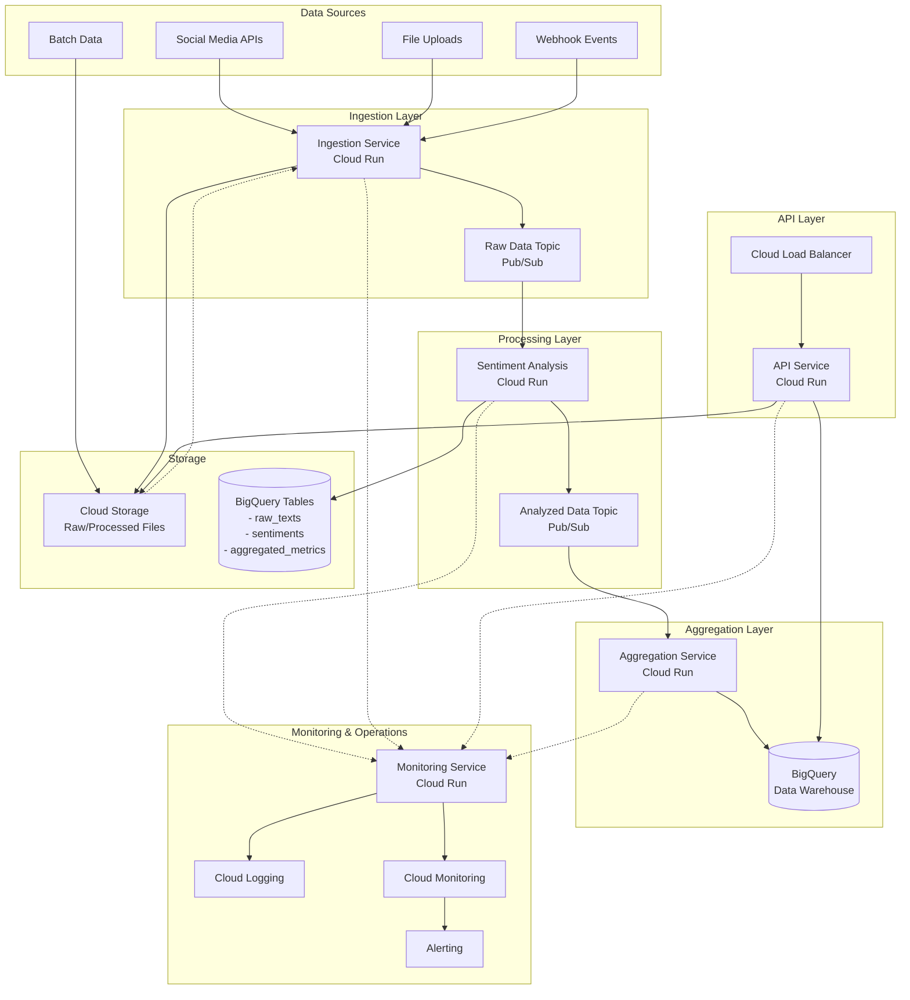

# Massive Sentiment Analyzer (MSA) - System Architecture

## Overview

The Massive Sentiment Analyzer (MSA) is a cloud-native, event-driven system designed to process, analyze, and aggregate sentiment from large volumes of text data in real-time. Built on Google Cloud Platform (GCP), MSA leverages managed services for scalability, reliability, and cost-efficiency.

## Architecture Diagram

## System Components

### 1. Ingestion Service
**Technology**: Cloud Run (Python/FastAPI)  
**Responsibilities**:
- Accept data from multiple sources (REST API, webhooks, file uploads)
- Validate and normalize input data
- Publish raw text data to Pub/Sub topic
- Store raw data in Cloud Storage for audit trail
- Rate limiting and quota management
- Error handling and dead-letter queue management

**Scaling**: Auto-scales based on request volume (0-100 instances)

### 2. Sentiment Analysis Service
**Technology**: Cloud Run (Python with Gemini API)  
**Responsibilities**:
- Subscribe to raw data Pub/Sub topic
- Perform sentiment analysis using Gemini 2.0 Flash
- Extract sentiment scores, emotions, and key entities
- Store results in BigQuery `sentiments` table
- Publish enriched data to analyzed data Pub/Sub topic
- Batch processing for efficiency
- Handle API rate limits with exponential backoff

**Scaling**: Auto-scales based on Pub/Sub message queue depth

### 3. Aggregation Service
**Technology**: Cloud Run (Python)  
**Responsibilities**:
- Subscribe to analyzed data Pub/Sub topic
- Calculate rolling aggregations (hourly, daily, weekly)
- Compute trend metrics and statistical summaries
- Store aggregated results in BigQuery `aggregated_metrics` table
- Trigger alerts for anomalies or significant sentiment shifts
- Maintain materialized views for common queries

**Scaling**: Auto-scales based on Pub/Sub message queue depth

### 4. API Service
**Technology**: Cloud Run (Python/FastAPI) behind Cloud Load Balancer  
**Responsibilities**:
- RESTful API for querying sentiment data
- Authentication and authorization (API keys, OAuth)
- Query BigQuery for historical data
- Serve real-time metrics and dashboards
- Rate limiting per tenant
- Caching layer for frequent queries (Cloud Memorystore/Redis)

**Scaling**: Auto-scales based on request volume

### 5. Monitoring Service
**Technology**: Cloud Run (Python) + Cloud Monitoring  
**Responsibilities**:
- Collect system health metrics
- Monitor processing latency and throughput
- Track API usage and quota consumption
- Detect and alert on anomalies
- Generate operational dashboards
- Cost tracking and optimization recommendations

**Scaling**: Fixed minimal instances for continuous monitoring

## Data Flow

### Primary Flow (Real-time)
1. **Ingestion**: Data arrives via API/webhook → Validated → Published to `raw-data-topic`
2. **Analysis**: Sentiment service consumes messages → Analyzes with Gemini → Stores in BigQuery → Publishes to `analyzed-data-topic`
3. **Aggregation**: Aggregation service consumes messages → Computes metrics → Stores in BigQuery
4. **Consumption**: API service queries BigQuery → Returns results to clients

### Batch Flow
1. Large files uploaded to Cloud Storage
2. Cloud Storage triggers Cloud Function
3. Cloud Function chunks data and publishes to `raw-data-topic`
4. Continues through primary flow

## Technology Stack

| Component | Technology | Justification |
|-----------|-----------|---------------|
| **Compute** | Cloud Run | Serverless, auto-scaling, pay-per-use |
| **Messaging** | Pub/Sub | Reliable, scalable event streaming |
| **Data Warehouse** | BigQuery | Petabyte-scale analytics, SQL interface |
| **Object Storage** | Cloud Storage | Durable, cost-effective file storage |
| **AI/ML** | Gemini 2.0 Flash | High-quality sentiment analysis, fast inference |
| **Infrastructure** | Terraform | Infrastructure as Code, version control |
| **Language** | Python 3.11+ | Rich ecosystem, async support, ML libraries |
| **API Framework** | FastAPI | Fast, modern, auto-documentation |
| **Monitoring** | Cloud Monitoring + Logging | Native GCP integration |
| **Secrets** | Secret Manager | Secure credential storage |

## Scalability & Performance

### Design Principles
- **Horizontal Scaling**: All services auto-scale independently
- **Asynchronous Processing**: Event-driven architecture prevents blocking
- **Idempotency**: All processing steps handle duplicates gracefully
- **Batching**: Process messages in batches to optimize API calls and costs
- **Caching**: Cache frequent queries and results

### Expected Performance
- **Ingestion**: 10,000+ requests/second
- **Analysis**: 500-1,000 texts/second (depends on Gemini API quota)
- **Query Latency**: < 200ms for 95th percentile
- **End-to-End Latency**: < 30 seconds from ingestion to queryable result

## Security

### Authentication & Authorization
- API keys for programmatic access
- OAuth 2.0 for user authentication
- Service account-based authentication between GCP services
- Least privilege IAM roles

### Data Protection
- Encryption at rest (default GCP encryption)
- Encryption in transit (TLS 1.3)
- VPC Service Controls for data exfiltration prevention
- Audit logging for all data access

### Compliance Considerations
- GDPR: Right to deletion, data minimization
- Data retention policies (configurable per tenant)
- PII detection and masking capabilities

## Cost Optimization

### Strategies
1. **Auto-scaling**: Scale to zero when idle
2. **Batch Processing**: Optimize Gemini API calls
3. **BigQuery**: Partition tables by date, cluster by key fields
4. **Cloud Storage**: Lifecycle policies for archival
5. **Committed Use Discounts**: For predictable baseline load
6. **Regional Resources**: Use single region (us-central1) to minimize egress costs

### Estimated Monthly Cost (10M analyses/month)
- Cloud Run: $500-1,000
- Pub/Sub: $200-400
- BigQuery: $300-600 (storage + queries)
- Gemini API: $2,000-4,000 (Flash pricing)
- Cloud Storage: $50-100
- **Total**: ~$3,000-6,000/month

## Disaster Recovery & High Availability

### Backup Strategy
- BigQuery: Daily snapshots, 7-day retention
- Cloud Storage: Multi-regional buckets for critical data
- Infrastructure: Terraform state in Cloud Storage with versioning

### Failure Handling
- **Service Failure**: Auto-restart, health checks
- **Message Loss**: Pub/Sub acknowledgment deadlines, retry policies
- **Data Corruption**: Write-ahead logging, transaction boundaries
- **Regional Outage**: Multi-region deployment (Phase 2)

### SLA Targets
- **Availability**: 99.9% uptime for API service
- **Data Durability**: 99.999999999% (11 9's - GCP SLA)
- **Recovery Time Objective (RTO)**: < 1 hour
- **Recovery Point Objective (RPO)**: < 5 minutes

## Development & Deployment

### Environments
- **Development**: Local Docker Compose + GCP emulators
- **Staging**: Isolated GCP project, scaled-down resources
- **Production**: Full-scale GCP project

### CI/CD Pipeline
1. Code commit → GitHub
2. GitHub Actions triggers tests (unit, integration)
3. Build Docker images → Artifact Registry
4. Terraform plan → Review
5. Terraform apply → Deploy to Cloud Run
6. Smoke tests → Verify deployment
7. Gradual traffic migration (blue/green deployment)

## Future Enhancements (Post-MVP)

- [ ] Multi-language support for sentiment analysis
- [ ] Custom ML models for domain-specific sentiment
- [ ] Real-time streaming dashboard with WebSockets
- [ ] Multi-region deployment for global availability
- [ ] Advanced analytics (topic modeling, trend forecasting)
- [ ] Integration with BI tools (Looker, Tableau)
- [ ] Self-service tenant onboarding portal
