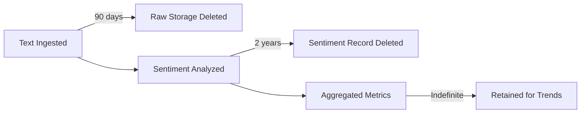

# Massive Sentiment Analyzer (MSA) - Data Model

## Overview

This document defines all data structures, schemas, and models used throughout the MSA system, including Pub/Sub message formats, BigQuery table schemas, API request/response models, and internal data structures.

## 1. Pub/Sub Message Schemas

### 1.1 Raw Data Topic (`raw-data-topic`)

**Published by**: Ingestion Service  
**Consumed by**: Sentiment Analysis Service

```json
{
  "message_id": "uuid-v4",
  "timestamp": "2025-12-11T21:30:00Z",
  "tenant_id": "tenant-123",
  "source": "api|webhook|batch|file_upload",
  "source_metadata": {
    "api_key": "key-abc123",
    "ip_address": "192.168.1.1",
    "user_agent": "Mozilla/5.0...",
    "batch_id": "batch-xyz789"
  },
  "data": {
    "text_id": "text-unique-id",
    "text": "This product is absolutely amazing! Love it!",
    "language": "en",
    "metadata": {
      "author_id": "user-456",
      "platform": "twitter|reddit|review",
      "url": "https://twitter.com/...",
      "timestamp": "2025-12-11T21:25:00Z",
      "custom_fields": {
        "product_id": "prod-789",
        "category": "electronics"
      }
    }
  }
}
```

**Field Descriptions**:
- `message_id`: Unique identifier for this Pub/Sub message (for idempotency)
- `timestamp`: When the message was published (ISO 8601)
- `tenant_id`: Multi-tenant identifier
- `source`: Origin of the data
- `source_metadata`: Contextual information about the source
- `data.text_id`: Unique identifier for the text being analyzed
- `data.text`: The actual text to analyze (max 10,000 characters)
- `data.language`: ISO 639-1 language code (only "en" supported in MVP)
- `data.metadata`: Optional contextual information about the text

### 1.2 Analyzed Data Topic (`analyzed-data-topic`)

**Published by**: Sentiment Analysis Service  
**Consumed by**: Aggregation Service

```json
{
  "message_id": "uuid-v4",
  "timestamp": "2025-12-11T21:30:05Z",
  "tenant_id": "tenant-123",
  "text_id": "text-unique-id",
  "original_message_id": "uuid-of-raw-message",
  "sentiment_result": {
    "overall_sentiment": "positive|negative|neutral|mixed",
    "sentiment_score": 0.85,
    "confidence": 0.92,
    "emotions": {
      "joy": 0.8,
      "anger": 0.05,
      "sadness": 0.02,
      "fear": 0.01,
      "surprise": 0.12
    },
    "key_phrases": [
      {"phrase": "absolutely amazing", "sentiment": "positive", "score": 0.95},
      {"phrase": "love it", "sentiment": "positive", "score": 0.88}
    ],
    "entities": [
      {"text": "product", "type": "CONSUMER_GOOD", "sentiment": "positive"}
    ],
    "toxicity": {
      "is_toxic": false,
      "toxicity_score": 0.02,
      "categories": {
        "profanity": 0.01,
        "hate_speech": 0.0,
        "harassment": 0.0
      }
    }
  },
  "processing_metadata": {
    "model": "gemini-2.0-flash",
    "processing_time_ms": 1250,
    "retry_count": 0,
    "processed_at": "2025-12-11T21:30:05Z"
  },
  "original_metadata": {
    "author_id": "user-456",
    "platform": "twitter",
    "url": "https://twitter.com/...",
    "timestamp": "2025-12-11T21:25:00Z",
    "custom_fields": {
      "product_id": "prod-789",
      "category": "electronics"
    }
  }
}
```

**Field Descriptions**:
- `overall_sentiment`: Primary sentiment classification
- `sentiment_score`: Numerical score from -1.0 (very negative) to +1.0 (very positive)
- `confidence`: Model's confidence in the sentiment classification (0.0-1.0)
- `emotions`: Breakdown of detected emotions (0.0-1.0 for each)
- `key_phrases`: Important phrases with their individual sentiments
- `entities`: Named entities detected in the text
- `toxicity`: Toxicity detection results (safety filtering)

## 2. BigQuery Schemas

### 2.1 `raw_texts` Table

**Purpose**: Audit trail of all ingested texts  
**Partition**: By `ingested_at` (daily)  
**Clustering**: By `tenant_id`, `source`

```sql
CREATE TABLE `msa_production.raw_texts` (
  -- Primary identifiers
  text_id STRING NOT NULL,
  message_id STRING NOT NULL,
  tenant_id STRING NOT NULL,
  
  -- Content
  text STRING NOT NULL,
  language STRING NOT NULL,
  
  -- Source metadata
  source STRING NOT NULL,
  source_api_key STRING,
  source_ip_address STRING,
  batch_id STRING,
  
  -- Original metadata (JSON)
  metadata JSON,
  
  -- Timestamps
  ingested_at TIMESTAMP NOT NULL,
  text_timestamp TIMESTAMP,
  
  -- Audit
  created_at TIMESTAMP NOT NULL DEFAULT CURRENT_TIMESTAMP()
)
PARTITION BY DATE(ingested_at)
CLUSTER BY tenant_id, source;
```

### 2.2 `sentiments` Table

**Purpose**: Storing all sentiment analysis results  
**Partition**: By `processed_at` (daily)  
**Clustering**: By `tenant_id`, `overall_sentiment`

```sql
CREATE TABLE `msa_production.sentiments` (
  -- Primary identifiers
  sentiment_id STRING NOT NULL,
  text_id STRING NOT NULL,
  tenant_id STRING NOT NULL,
  message_id STRING NOT NULL,
  
  -- Sentiment results
  overall_sentiment STRING NOT NULL,
  sentiment_score FLOAT64 NOT NULL,
  confidence FLOAT64 NOT NULL,
  
  -- Emotion breakdown
  emotion_joy FLOAT64,
  emotion_anger FLOAT64,
  emotion_sadness FLOAT64,
  emotion_fear FLOAT64,
  emotion_surprise FLOAT64,
  
  -- Detailed analysis (JSON)
  key_phrases JSON,
  entities JSON,
  
  -- Toxicity
  is_toxic BOOLEAN NOT NULL,
  toxicity_score FLOAT64,
  toxicity_details JSON,
  
  -- Processing metadata
  model STRING NOT NULL,
  processing_time_ms INT64,
  retry_count INT64,
  processed_at TIMESTAMP NOT NULL,
  
  -- Original metadata for enrichment
  metadata JSON,
  
  -- Audit
  created_at TIMESTAMP NOT NULL DEFAULT CURRENT_TIMESTAMP()
)
PARTITION BY DATE(processed_at)
CLUSTER BY tenant_id, overall_sentiment;
```

### 2.3 `aggregated_metrics` Table

**Purpose**: Pre-computed aggregations for fast querying  
**Partition**: By `period_start` (daily)  
**Clustering**: By `tenant_id`, `aggregation_level`

```sql
CREATE TABLE `msa_production.aggregated_metrics` (
  -- Identifiers
  metric_id STRING NOT NULL,
  tenant_id STRING NOT NULL,
  
  -- Aggregation metadata
  aggregation_level STRING NOT NULL, -- 'hourly', 'daily', 'weekly', 'monthly'
  period_start TIMESTAMP NOT NULL,
  period_end TIMESTAMP NOT NULL,
  
  -- Dimensions (optional grouping)
  dimensions JSON, -- e.g., {"platform": "twitter", "product_id": "prod-789"}
  
  -- Aggregate statistics
  total_texts INT64 NOT NULL,
  total_positive INT64,
  total_negative INT64,
  total_neutral INT64,
  total_mixed INT64,
  
  -- Sentiment scores
  avg_sentiment_score FLOAT64,
  median_sentiment_score FLOAT64,
  stddev_sentiment_score FLOAT64,
  
  -- Emotion aggregates
  avg_emotion_joy FLOAT64,
  avg_emotion_anger FLOAT64,
  avg_emotion_sadness FLOAT64,
  avg_emotion_fear FLOAT64,
  avg_emotion_surprise FLOAT64,
  
  -- Toxicity
  total_toxic INT64,
  toxicity_rate FLOAT64,
  
  -- Trend indicators
  sentiment_trend STRING, -- 'improving', 'declining', 'stable'
  trend_score FLOAT64, -- Change from previous period
  
  -- Processing metadata
  computed_at TIMESTAMP NOT NULL,
  
  -- Audit
  created_at TIMESTAMP NOT NULL DEFAULT CURRENT_TIMESTAMP()
)
PARTITION BY DATE(period_start)
CLUSTER BY tenant_id, aggregation_level;
```

### 2.4 `api_usage` Table

**Purpose**: Track API usage for billing and quotas  
**Partition**: By `request_timestamp` (daily)  
**Clustering**: By `tenant_id`, `api_key`

```sql
CREATE TABLE `msa_production.api_usage` (
  -- Identifiers
  usage_id STRING NOT NULL,
  tenant_id STRING NOT NULL,
  api_key STRING NOT NULL,
  
  -- Request details
  endpoint STRING NOT NULL,
  http_method STRING NOT NULL,
  http_status INT64,
  
  -- Usage metrics
  texts_analyzed INT64,
  response_time_ms INT64,
  
  -- Timestamps
  request_timestamp TIMESTAMP NOT NULL,
  
  -- Audit
  created_at TIMESTAMP NOT NULL DEFAULT CURRENT_TIMESTAMP()
)
PARTITION BY DATE(request_timestamp)
CLUSTER BY tenant_id, api_key;
```

## 3. API Request/Response Models

### 3.1 Analyze Text (Single)

**Endpoint**: `POST /v1/analyze`

**Request**:
```json
{
  "text": "This product is absolutely amazing! Love it!",
  "language": "en",
  "metadata": {
    "author_id": "user-456",
    "platform": "twitter",
    "url": "https://twitter.com/...",
    "custom_fields": {
      "product_id": "prod-789"
    }
  },
  "options": {
    "include_emotions": true,
    "include_entities": true,
    "include_key_phrases": true,
    "detect_toxicity": true
  }
}
```

**Response** (202 Accepted - Async):
```json
{
  "text_id": "text-unique-id",
  "status": "queued",
  "estimated_completion": "2025-12-11T21:30:30Z",
  "message": "Text queued for analysis"
}
```

**Response** (200 OK - Sync, if enabled):
```json
{
  "text_id": "text-unique-id",
  "status": "completed",
  "sentiment_result": {
    "overall_sentiment": "positive",
    "sentiment_score": 0.85,
    "confidence": 0.92,
    "emotions": {
      "joy": 0.8,
      "anger": 0.05,
      "sadness": 0.02,
      "fear": 0.01,
      "surprise": 0.12
    },
    "key_phrases": [
      {"phrase": "absolutely amazing", "sentiment": "positive", "score": 0.95}
    ],
    "entities": [
      {"text": "product", "type": "CONSUMER_GOOD", "sentiment": "positive"}
    ],
    "toxicity": {
      "is_toxic": false,
      "toxicity_score": 0.02
    }
  },
  "processing_time_ms": 1250,
  "processed_at": "2025-12-11T21:30:05Z"
}
```

### 3.2 Batch Analyze

**Endpoint**: `POST /v1/analyze/batch`

**Request**:
```json
{
  "texts": [
    {
      "text_id": "text-1",
      "text": "Great product!",
      "metadata": {"product_id": "prod-789"}
    },
    {
      "text_id": "text-2",
      "text": "Terrible experience.",
      "metadata": {"product_id": "prod-789"}
    }
  ],
  "options": {
    "include_emotions": false,
    "include_entities": false
  }
}
```

**Response**:
```json
{
  "batch_id": "batch-xyz789",
  "total_texts": 2,
  "status": "processing",
  "estimated_completion": "2025-12-11T21:32:00Z",
  "webhook_url": "https://yourapp.com/webhook/batch-complete"
}
```

### 3.3 Query Sentiments

**Endpoint**: `GET /v1/sentiments`

**Query Parameters**:
- `tenant_id` (required)
- `start_date` (ISO 8601)
- `end_date` (ISO 8601)
- `sentiment` (positive|negative|neutral|mixed)
- `platform` (from original metadata)
- `limit` (default: 100, max: 1000)
- `offset` (for pagination)

**Response**:
```json
{
  "total": 1523,
  "limit": 100,
  "offset": 0,
  "results": [
    {
      "text_id": "text-unique-id",
      "text": "This product is absolutely amazing!",
      "overall_sentiment": "positive",
      "sentiment_score": 0.85,
      "confidence": 0.92,
      "processed_at": "2025-12-11T21:30:05Z",
      "metadata": {
        "platform": "twitter",
        "product_id": "prod-789"
      }
    }
  ]
}
```

### 3.4 Get Aggregated Metrics

**Endpoint**: `GET /v1/metrics/aggregated`

**Query Parameters**:
- `tenant_id` (required)
- `aggregation_level` (hourly|daily|weekly|monthly)
- `start_date` (ISO 8601)
- `end_date` (ISO 8601)
- `dimensions` (JSON, optional filters)

**Response**:
```json
{
  "aggregation_level": "daily",
  "period_start": "2025-12-11T00:00:00Z",
  "period_end": "2025-12-11T23:59:59Z",
  "metrics": [
    {
      "date": "2025-12-11",
      "total_texts": 15234,
      "sentiment_breakdown": {
        "positive": 8521,
        "negative": 3211,
        "neutral": 2987,
        "mixed": 515
      },
      "avg_sentiment_score": 0.34,
      "emotions": {
        "joy": 0.42,
        "anger": 0.18,
        "sadness": 0.12,
        "fear": 0.08,
        "surprise": 0.20
      },
      "toxicity_rate": 0.023,
      "trend": "improving",
      "trend_score": 0.12
    }
  ]
}
```

## 4. Internal Data Structures

### 4.1 Python Models (Pydantic)

```python
from pydantic import BaseModel, Field
from typing import Optional, Dict, Any, List
from datetime import datetime
from enum import Enum

class SentimentType(str, Enum):
    POSITIVE = "positive"
    NEGATIVE = "negative"
    NEUTRAL = "neutral"
    MIXED = "mixed"

class EmotionScores(BaseModel):
    joy: float = Field(ge=0.0, le=1.0)
    anger: float = Field(ge=0.0, le=1.0)
    sadness: float = Field(ge=0.0, le=1.0)
    fear: float = Field(ge=0.0, le=1.0)
    surprise: float = Field(ge=0.0, le=1.0)

class KeyPhrase(BaseModel):
    phrase: str
    sentiment: SentimentType
    score: float = Field(ge=0.0, le=1.0)

class Entity(BaseModel):
    text: str
    type: str
    sentiment: Optional[SentimentType] = None

class ToxicityResult(BaseModel):
    is_toxic: bool
    toxicity_score: float = Field(ge=0.0, le=1.0)
    categories: Dict[str, float] = {}

class SentimentResult(BaseModel):
    overall_sentiment: SentimentType
    sentiment_score: float = Field(ge=-1.0, le=1.0)
    confidence: float = Field(ge=0.0, le=1.0)
    emotions: Optional[EmotionScores] = None
    key_phrases: Optional[List[KeyPhrase]] = None
    entities: Optional[List[Entity]] = None
    toxicity: Optional[ToxicityResult] = None

class AnalyzeRequest(BaseModel):
    text: str = Field(max_length=10000)
    language: str = Field(default="en", pattern="^[a-z]{2}$")
    metadata: Optional[Dict[str, Any]] = None
    options: Optional[Dict[str, bool]] = {
        "include_emotions": True,
        "include_entities": True,
        "include_key_phrases": True,
        "detect_toxicity": True
    }

class AnalyzeResponse(BaseModel):
    text_id: str
    status: str  # "queued", "processing", "completed", "failed"
    sentiment_result: Optional[SentimentResult] = None
    processing_time_ms: Optional[int] = None
    processed_at: Optional[datetime] = None
    error: Optional[str] = None
```

## 5. Data Validation Rules

### Text Validation
- **Length**: 1-10,000 characters
- **Language**: Must be valid ISO 639-1 code (only "en" in MVP)
- **Encoding**: UTF-8
- **Prohibited Content**: No binary data encoded as text

### Tenant Validation
- **tenant_id**: Alphanumeric, 3-50 characters, format: `tenant-{uuid}`
- **API Key**: 32-character hexadecimal string
- **Uniqueness**: Enforced at database level

### Timestamp Validation
- **Format**: ISO 8601 with timezone (UTC preferred)
- **Range**: Not in future, not older than 10 years
- **Required**: All timestamps must be present

## 6. Data Lifecycle



**Retention Policies**:
1. **Raw Texts**: 90 days (Cloud Storage lifecycle policy)
2. **Sentiment Results**: 2 years (BigQuery table expiration)
3. **Aggregated Metrics**: Indefinite (historical trends)
4. **API Usage Logs**: 1 year

## 7. Indexing & Performance

### BigQuery Optimization
- **Partitioning**: All tables partitioned by date (daily)
- **Clustering**: Multi-column clustering for common query patterns
- **Materialized Views**: For frequently accessed aggregations
- **Query Optimization**: Avoid SELECT *, use specific date ranges

### Expected Query Performance
- **Point Lookup** (by text_id): < 100ms
- **Range Query** (30 days): < 2 seconds
- **Aggregation Query** (90 days): < 5 seconds
- **Full Scan** (1 year): < 30 seconds

---

**Version**: 1.0  
**Last Updated**: 2025-12-11  
**Owner**: Architecture Team
