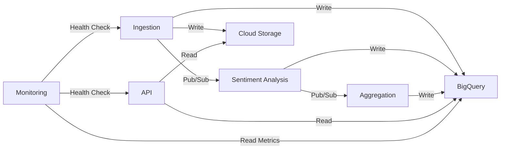

# Microservices Documentation

This document describes each microservice in the Massive Sentiment Analyzer (MSA) system.

## 1. Ingestion Service

### Purpose
Entry point for all text data into the MSA system. Handles various data sources and publishes to the processing pipeline.

### Responsibilities
- **API Endpoints**: Accept text data via REST API (`POST /v1/analyze`, `POST /v1/analyze/batch`)
- **Webhook Handler**: Receive data from external webhooks
- **File Upload**: Process batch file uploads (CSV, JSON)
- **Validation**: Validate input data (text length, format, required fields)
- **Normalization**: Standardize data format for consistent processing
- **Publishing**: Publish validated data to `raw-data-topic` (Pub/Sub)
- **Audit Trail**: Store raw data in Cloud Storage and BigQuery `raw_texts` table
- **Rate Limiting**: Enforce per-tenant quotas
- **Error Handling**: Return appropriate HTTP status codes and error messages

### Technology Stack
- **Framework**: FastAPI
- **Runtime**: Cloud Run (Python 3.11+)
- **Dependencies**: google-cloud-pubsub, google-cloud-storage, google-cloud-bigquery

### Scaling Configuration
- **Min Instances**: 0 (scale to zero when idle)
- **Max Instances**: 100
- **Concurrency**: 80 requests per instance
- **CPU**: 1 vCPU
- **Memory**: 512 MiB
- **Timeout**: 300s

### API Endpoints

#### `POST /v1/analyze` - Single Text Analysis
**Request**:
```json
{
  "text": "Your text here",
  "language": "en",
  "metadata": {"custom": "fields"}
}
```

**Response** (202 Accepted):
```json
{
  "text_id": "uuid",
  "status": "queued",
  "estimated_completion": "ISO-8601-timestamp"
}
```

#### `POST /v1/analyze/batch` - Batch Analysis
**Request**:
```json
{
  "texts": [{"text": "...", "metadata": {}}]
}
```

**Response** (202 Accepted):
```json
{
  "batch_id": "uuid",
  "total_texts": 100,
  "status": "processing"
}
```

#### `GET /health` - Health Check
Returns 200 OK if service is healthy.

### Environment Variables
- `RAW_DATA_TOPIC`: Pub/Sub topic name
- `GCS_RAW_BUCKET`: Cloud Storage bucket for raw data
- `BIGQUERY_DATASET`: BigQuery dataset ID
- `MAX_TEXT_LENGTH`: Maximum allowed text length (default: 10000)
- `RATE_LIMIT_PER_MINUTE`: Per-tenant rate limit (default: 1000)

---

## 2. Sentiment Analysis Service

### Purpose
Core sentiment analysis engine using Gemini 2.0 Flash to analyze text and extract sentiment, emotions, entities, and toxicity.

### Responsibilities
- **Subscribe**: Pull messages from `raw-data-topic` subscription
- **Batch Processing**: Group messages for efficient API calls
- **Sentiment Analysis**: Call Gemini API to analyze text
- **Result Parsing**: Extract sentiment scores, emotions, entities, key phrases
- **Toxicity Detection**: Detect toxic content
- **Storage**: Store results in BigQuery `sentiments` table
- **Publishing**: Publish analyzed data to `analyzed-data-topic`
- **Retry Logic**: Handle transient failures with exponential backoff
- **Rate Limiting**: Respect Gemini API quotas (1000 RPM)

### Technology Stack
- **Framework**: Python asyncio
- **Runtime**: Cloud Run (Python 3.11+)
- **AI**: Gemini 2.0 Flash API
- **Dependencies**: google-generativeai, google-cloud-pubsub, google-cloud-bigquery

### Scaling Configuration
- **Min Instances**: 1 (always running for low latency)
- **Max Instances**: 50
- **Concurrency**: 10 concurrent message processing
- **CPU**: 2 vCPU
- **Memory**: 1 GiB
- **Timeout**: 600s

### Processing Flow
1. Pull batch of messages from Pub/Sub (up to 100)
2. For each message, call Gemini API with prompt template
3. Parse Gemini response into structured sentiment result
4. Store result in BigQuery `sentiments` table
5. Publish to `analyzed-data-topic`
6. Acknowledge message in Pub/Sub

### Gemini Prompt Template
```
Analyze the sentiment of the following text.

Text: "{text}"

Provide a JSON response with:
- overall_sentiment: positive|negative|neutral|mixed
- sentiment_score: -1.0 to 1.0
- confidence: 0.0 to 1.0
- emotions: {joy, anger, sadness, fear, surprise} (0-1 each)
- key_phrases: [{phrase, sentiment, score}]
- entities: [{text, type, sentiment}]
- toxicity: {is_toxic, toxicity_score, categories}
```

### Error Handling
- **Gemini API Error**: Retry up to 3 times with exponential backoff
- **Parse Error**: Log and move to dead-letter queue
- **Rate Limit**: Wait and retry after backoff period

### Environment Variables
- `RAW_DATA_SUBSCRIPTION`: Pub/Sub subscription name
- `ANALYZED_DATA_TOPIC`: Pub/Sub topic name
- `BIGQUERY_DATASET`: BigQuery dataset ID
- `GEMINI_API_KEY`: Gemini API key (from Secret Manager)
- `BATCH_SIZE`: Number of messages to process per batch (default: 100)
- `MAX_RETRIES`: Maximum retry attempts (default: 3)

---

## 3. Aggregation Service

### Purpose
Compute pre-aggregated metrics for fast querying and trend analysis.

### Responsibilities
- **Subscribe**: Pull messages from `analyzed-data-topic` subscription
- **Real-time Aggregation**: Update hourly/daily/weekly/monthly metrics
- **Statistical Calculations**: Mean, median, stddev of sentiment scores
- **Trend Detection**: Identify improving/declining/stable trends
- **Storage**: Store aggregated metrics in BigQuery `aggregated_metrics` table
- **Materialized Views**: Update BigQuery materialized views
- **Alerting**: Trigger alerts for anomalous sentiment shifts

### Technology Stack
- **Framework**: Python asyncio
- **Runtime**: Cloud Run (Python 3.11+)
- **Dependencies**: google-cloud-pubsub, google-cloud-bigquery, pandas

### Scaling Configuration
- **Min Instances**: 1
- **Max Instances**: 20
- **Concurrency**: 20
- **CPU**: 1 vCPU
- **Memory**: 512 MiB
- **Timeout**: 300s

### Aggregation Levels
1. **Hourly**: Last 24 hours, rolling window
2. **Daily**: Last 90 days
3. **Weekly**: Last 52 weeks
4. **Monthly**: Last 24 months

### Metrics Computed
- Total texts analyzed
- Sentiment breakdown (positive, negative, neutral, mixed)
- Average sentiment score
- Emotion averages
- Toxicity rate
- Trend indicators (comparing to previous period)

### Environment Variables
- `ANALYZED_DATA_SUBSCRIPTION`: Pub/Sub subscription name
- `BIGQUERY_DATASET`: BigQuery dataset ID
- `AGGREGATION_WINDOW_MINUTES`: Aggregation window (default: 60)

---

## 4. API Service

### Purpose
Public-facing REST API for querying sentiment data and metrics.

### Responsibilities
- **Query Interface**: Provide REST API for data retrieval
- **Authentication**: Validate API keys
- **Authorization**: Enforce tenant-scoped data access
- **BigQuery Querying**: Execute optimized queries on sentiment data
- **Caching**: Cache frequent queries for performance
- **Rate Limiting**: Enforce per-tenant API quotas
- **Documentation**: Serve OpenAPI/Swagger documentation

### Technology Stack
- **Framework**: FastAPI
- **Runtime**: Cloud Run (Python 3.11+)
- **Dependencies**: google-cloud-bigquery, fastapi, redis (optional)

### Scaling Configuration
- **Min Instances**: 1
- **Max Instances**: 50
- **Concurrency**: 100
- **CPU**: 1 vCPU
- **Memory**: 512 MiB
- **Timeout**: 60s

### API Endpoints

#### `GET /v1/sentiments` - Query Sentiment Results
Query parameters: `tenant_id`, `start_date`, `end_date`, `sentiment`, `limit`, `offset`

#### `GET /v1/metrics/aggregated` - Get Aggregated Metrics
Query parameters: `tenant_id`, `aggregation_level`, `start_date`, `end_date`, `dimensions`

#### `GET /v1/tenants/{tenant_id}/usage` - Get Usage Statistics
Returns API usage, quota consumption, and billing data.

#### `GET /v1/status/{text_id}` - Check Analysis Status
Returns status of a specific text analysis.

#### `GET /health` - Health Check

#### `GET /docs` - OpenAPI Documentation

### Environment Variables
- `BIGQUERY_DATASET`: BigQuery dataset ID
- `GCS_BUCKET`: Cloud Storage bucket
- `CACHE_ENABLED`: Enable Redis caching (default: false)
- `CACHE_TTL_SECONDS`: Cache TTL (default: 3600)

---

## 5. Monitoring Service

### Purpose
System health monitoring, metrics collection, and alerting.

### Responsibilities
- **Health Checks**: Monitor all services' health endpoints
- **Metrics Collection**: Gather processing metrics from BigQuery
- **Performance Monitoring**: Track latency, throughput, error rates
- **Cost Tracking**: Monitor GCP spending and quota usage
- **Alerting**: Send alerts for critical issues
- **Dashboard Updates**: Update Cloud Monitoring dashboards

### Technology Stack
- **Framework**: Python
- **Runtime**: Cloud Run (Python 3.11+)
- **Dependencies**: google-cloud-monitoring, google-cloud-logging, google-cloud-bigquery

### Scaling Configuration
- **Min Instances**: 1 (always running)
- **Max Instances**: 5
- **Concurrency**: 50
- **CPU**: 1 vCPU
- **Memory**: 256 MiB
- **Timeout**: 60s

### Monitored Metrics
- **Service Health**: HTTP health check status (200 OK)
- **Queue Depth**: Pub/Sub message backlog
- **Processing Latency**: End-to-end time from ingestion to analysis
- **Error Rate**: Percentage of failed requests
- **Gemini API Usage**: Request count, quota consumption
- **BigQuery Performance**: Query execution times
- **Cost Metrics**: Daily spending by service

### Alerts
- **High Queue Depth**: > 10,000 messages in Pub/Sub
- **High Error Rate**: > 5% errors in 5-minute window
- **Service Down**: Health check fails for > 2 minutes
- **Budget Alert**: Monthly spending > $5,000
- **Quota Alert**: Gemini API approaching daily limit

### Environment Variables
- `BIGQUERY_DATASET`: BigQuery dataset ID
- `ALERT_EMAIL`: Email for critical alerts
- `ALERT_SLACK_WEBHOOK`: Slack webhook URL
- `MONITORING_INTERVAL_SECONDS`: Check interval (default: 60)

---

## Service Communication



## Deployment Order
1. **Infrastructure** (Terraform): Pub/Sub, BigQuery, Cloud Storage, IAM
2. **Aggregation Service**: Can start processing once infrastructure is ready
3. **Sentiment Analysis Service**: Core processing engine
4. **Ingestion Service**: Entry point for data
5. **API Service**: Query interface
6. **Monitoring Service**: Operational visibility

---

**Version**: 1.0  
**Last Updated**: 2025-12-11  
**Status**: Architecture Phase
